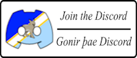
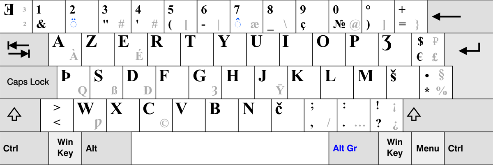
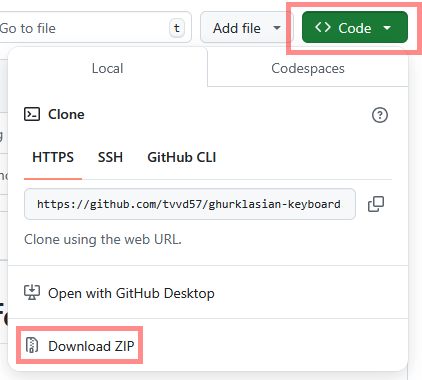
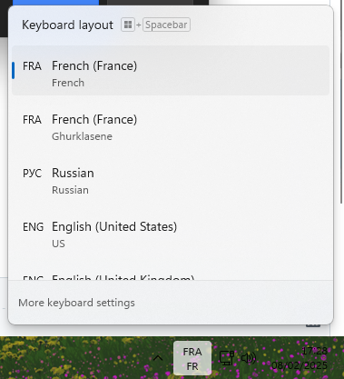

# Ghurklasian keyboard support for Windows

## Information 

This project was made using the *Microsoft Windows Layout Creator (MSKLC)*. It is a keyboard layout made for the [Ghurklasian language](https://www.ghurklasian-library.com/), based on [AZERTY](https://en.wikipedia.org/wiki/AZERTY).

## Download instructions

- First, use the ``Code`` button to download the file as a ZIP
- Extract everything and launch ``setup.exe``

- After the installation is complete, you'll be able to find the keyboard in your keyboard list (if the menu cannot be found, check your windows settings)

